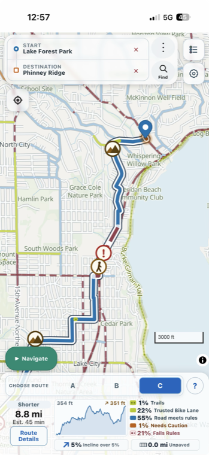
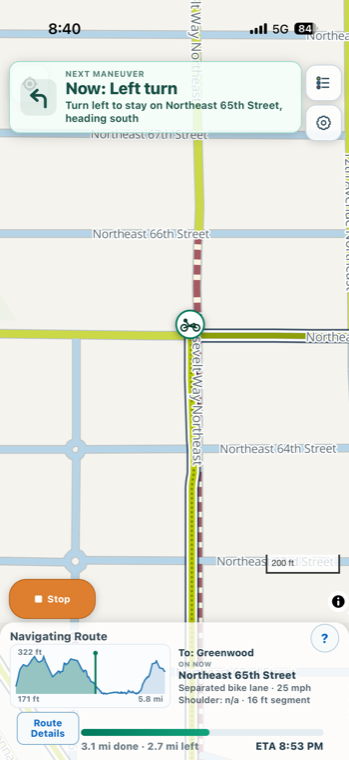
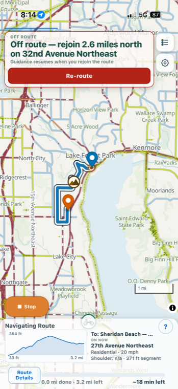

# Human TODO List

**AGENTS: STOP WRITING TO THIS FILE.** It is edited on explicit human
request only. It is not your notepad, not a changelog, and not a place to
record releases, gates, or session findings — put those in commit messages.

This is a short, human-focused list of project TODOs. It is not an LLM
notepad, brainstorming log, or automatic issue tracker. Add, remove, reorder,
or rewrite items only when directed by a human, and keep the list concise.

Some items block on a **field verdict**: the project owner riding or browsing
real routes and reporting back. Do not simulate rides to close them.

## Open

---

### 1. Shoulder safety
Improve how road shoulders factor into safety verdicts. Not yet scoped —
waiting on examples from the field (specific roads scored wrong, and in which
direction). The shoulder model today: per-direction shoulder widths from the
WSDOT inventory, `minShoulder` rule, optional inference
(`inferShoulderFromEdge`), sidewalk fallback as last resort. See
`docs/SAFETY-MODEL.md` ("A shoulder can depend on which way you ride" and
rung 6).

---

### 2. Downloadable map packs — machinery shipped, deployment pending

The release plan: ship the app with no bundled map data; download states from
a map store (ours on GitHub Releases; third parties can host their own).
The machinery is shipped and tested. Remaining, in order:

- **Host the store**: upload WA + OR packs and `index.json` to GitHub
  Releases (or equivalent), then verify the by-hand flow in
  `docs/IMPORT-A-STATE.md` from a clean profile.
- **First-run field verification**: the resident national map, explicit local
  location suggestion, confirmation card, exact-size download, cancellation,
  reload and persisted dismissal are implemented. Verify the configured live
  store and permission/download behavior in a slim WKWebView before shipping.
- **Slim iOS on a phone**: the slim shell has no service worker, so
  downloaded packs need verifying inside the Capacitor WKWebView (cache
  storage durability, range reads) before any App Store submission.
- **Decide the web deployment**: keep serving maps same-origin (works today,
  nothing changes) or move the web app to store downloads too.

---

### 4. Import and test all states
Import every U.S. state under the documented state-import process and verify
each state's data, routing, map rendering, place search, and cross-state
behavior. Feasibility study 2026-08-24 (PORTING-LESSONS G8,
`test_partition_catalogue_budget.mjs`): corridor memory is bounded by metro
partition size, not corridor length, so a large-metro state (California)
must be built with a finer partition grid; a state whose full graph exceeds
the device budget now routes its own trips through the partition session
automatically (`graphRawBytes` in region.json). The native iOS shell still
cannot serve store-installed states (no service worker) — that gap blocks
any store-delivered state on native and is the biggest open item for a
California release.

---

### 5. Data-completeness approach for all states
Define a repeatable way to measure source coverage, freshness, and quality for
every state against Washington's level. Establish evidence-based acceptance
criteria and make gaps visible before a state is considered comparable.

---

### 6. Release / go-to-market plan
Define the release sequence, deployment channels, target riders, positioning,
launch validation, and post-launch support plan.

---

### 8. Data licensing
Verify OSM and every other data source's licensing and attribution
requirements.

---

### 9. Finalize app name
Choose and approve the final public name for the app before release.

---

### 17. Tweak the segment details page
Three asks from the field, 2026-08-30.

- **Information richness.** The per-segment rows lost content over time and now
  read thin; decide what belongs back. `route-details.js` renders them and has
  not changed since v894 (`f55b868`, 2026-08-27), which retired the shoulder
  line.
- **Easy to close.** `routeDetailsDialog` in `index.html` has no close control
  at all — its head is a title and a description, then the iframe. Every other
  full-screen dialog carries a `dialog-close` button.
- **Name the highway.** Segments say the generic word `highway`
  (`route-details.js:740`) where `stateHighwayName` could resolve the actual
  route number.

---

### 18. Routing problems
Three from the field, 2026-08-30. Not yet diagnosed.

- **Lake Forest Park to Phinney offers Bothell Way as Route C**, a dangerous
  arterial, while the safe backroad option is not offered at all. Route C is
  offered as **"Shorter", 8.8 mi / 45 min, and 21% Fails Rules** — a fifth of
  the ride failing, on the option the chooser presents as the short one.
- **Phinney Ridge to Lake Forest Park routes via Lake City Way.**
- **Routing to Vancouver lists a bunch of ferry terminals** as destinations.

The first two are the same corridor in both directions, and Bothell Way and
Lake City Way are both SR 522 — so this reads as one complaint: the arterial
is being offered where a quieter parallel route exists. Worth checking whether
the backroad is being built and then dropped in selection, or never built.

The third is a destination-search problem, not a scoring one, so it likely
lives somewhere else entirely.

---

**Issue 18** — Lake Forest Park to Phinney Ridge. Route C is the one offered as
"Shorter": 8.8 mi, 45 min, **21% Fails Rules**.

---

### 19. Turn prompt contradicts itself — identified and FIXED (v958)
Field, 2026-08-30, at Roosevelt Way NE and NE 65th Street: "Turn left to stay
on Northeast 65th Street, heading south" on an east-west street.

The street name was the wrong half; the heading and the turn were right. The
route was leaving 65th for the unnamed separated track, and the only name in
the instruction's look-ahead window was a 16 ft sliver still carrying
"Northeast 65th Street" (the ON NOW card in the screenshot shows that very
sliver). Same name behind and "ahead" reads as staying on the street.
`navDestinationSegment` now treats a real stretch of unnamed path after the
junction as the destination itself: the same movement announces "Bear left
onto the bike path, heading south". Reproduced and pinned on the real graph
in `scripts/test_turn_onto_unnamed_path.mjs`.

---

**Issue 19** — the banner at Roosevelt Way NE and NE 65th Street.

---

### 20. Destination changed on its own while navigating in the background
Field, 2026-08-30. Navigation was running with the app in the background; on
reopening it, the destination had become **"Sheridan Beach"**, which the rider
did not choose, and the screen showed **OFF ROUTE — rejoin 2.6 miles north on
32nd Avenue Northeast**. Progress read **0.0 mi done, 3.2 mi left**.

**Fable DIAGNOSIS:** the plan was replaced, not relabelled — the To: line
reads `routing.endName`, so the app was genuinely navigating a stored
~3.2 mi trip ending at Sheridan Beach. Ruled out: no code path swaps the
destination during navigation (reroute, off-route recovery and the
connectors all keep `routing.end`), and navigation state does not survive a
reload, so the active session in the screenshot began after any reload.

One real defect found and FIXED (v958): a service-worker update taking
control reloaded every open copy of the app — including one navigating
mid-ride. The ride's state died and the page came back in planning mode on
whatever plan localStorage last held. v934–v954 all shipped on 2026-08-30,
so an update reload during that evening's ride is the likely first domino;
mid-ride reloads are now held until navigation ends. Not established from
here: how navigation became active on the stale plan afterwards — a Navigate
tap on reopening would do it, and nothing else found would. Two field
answers would settle it: was Navigate tapped after reopening, and was a
short Sheridan Beach loop planned earlier that day?

---

**Issue 20** — destination reads "Sheridan Beach", off route, 0.0 mi done.

